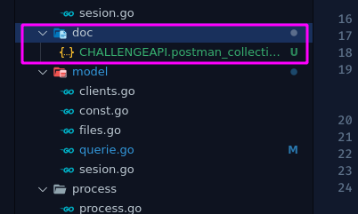
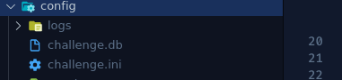

# **Example Api api**

## **Descripcion:**

Proyecto ejemplo de api con [ECHO]([https://echo.labstack.com/]) y golang  creada para hacer un programa de autentificacion e guardar clientes ademas de subir y descargar archivos.

### **Requisitos:**

* [Golang]([https://golang.org/])
* [Libcore]([https://github.com/rafael180496/libcore])
* [Postman]([https://www.postman.com/])

### **Base de datos**

El proyecto contiene un scrip backup para crear las tablas necesarias del proyecto ademas un usuario de prueba.

### **Documentacion**

En el proyecto se encuentra una carpeta llamada **doc** esta contiene un archivo postman este debera ser importado al proyecto.


### **Configurar el ini**

El proyecto se ejecuta con un .ini de configuracion esta la primera ves crea las carpetas necesaria para el proyecto.



#### **Configuracion por defecto**

```ini
[database]
    tipo = SQLLITE
    filedb = "config/challenge.db"

[server]
    debug  = TRUE
    puerto = 8000
```

### **Ejecucion:**

Para ejecutar el programa en modo de prueba y modo api.

```batch
go run apichallenge.go  -mode="api"
```

Para ejecutar el insertador de csv ejecutar el comando.

```batch
go run apichallenge.go  -mode="batch" -path="file/name.csv"
```

donde el **path** debe ser un archivo csv donde este debe ser el path directo.

### **Compilacion:**

La compilacion se ejecuta los scrip:

**Windows:**

```batch
buildwindows.bat
```

**Linux:**

```batch
./buildlinux.sh
```

### **Deploy api Docker**

Para deployar el api en un servidor docker se necesita:

* [Docker]([https://www.docker.com/])
* [Docker compose]([https://docs.docker.com/compose/])

Despues de instalar los programas descargar el repositorio y ejecutar el shellscript:

```batch
./buildlinuxdocker.sh
```

Este indicaciones fueron probadas solo en linux.
